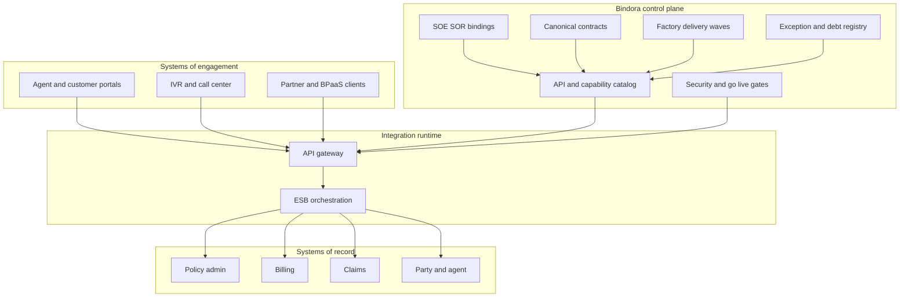

# Bindora

**Source:** `ai-in-enterprise/Deloitte_Framework-Mulesoft_Digital Ready Framework_0/`
**Domain:** `ai-enterprise`
**One-liner:** An insurance digital-ready control plane that governs API-led connections between systems of engagement and systems of record — so carriers and BPaaS platforms modernise policy, billing, claims, and agent journeys without deepening the legacy hairball.
**Wedge:** Mid-size P&C and life & annuity carriers (and their BPaaS partners) running concurrent core modernisation and digital/agent experience programs who need factory delivery of business APIs with SOA governance, not another point-to-point integration project.
**Positioning:** A productised **Digital Ready Framework** for insurance. The source shows Deloitte + MuleSoft enabling SE2’s Spectrum backbone for Aurum (life & annuity BPaaS) and Pekin’s PIVOT (Guidewire-centred P&C digital layer). Bindora turns those patterns into an operable control plane: canonical business services, SOE↔SOR contracts, API lifecycle, and phased factory delivery under insurance regulation.

## Market research synthesis

### Thesis from source

Insurance is transforming under simultaneous pressure from **regulation** (IFRS 9, IFRS 17, DOL rules), **automation** (RPA, AI), **standardisation** (underwriting, risk analysis, cost reduction), and **disruption** (blockchain, omni-channel, CX). Current-state architecture is a **complex legacy mix** — a “hairball” — that blocks new capabilities unless the backend is rewired. Enabling approach: Deloitte methods + SOA accelerators + API gateway/ESB patterns.

**SE2 Spectrum** case: digital backbone for Aurum life & annuity BPaaS; open architecture via Digital Life and Annuity APIs; API gateway + ESB + ETL; governance/framework layer; incremental enablement of business capabilities; explicit **SOE (system of engagement) / SOR (system of record)** integration; benefits cited include accelerated time-to-market, configuration-driven approach, operational efficiency, single version of truth, self-service, componentised API-led architecture, real-time integration, SOA/data governance, low/no-touch digital engagement. Implementation phases: Installation & Governance → Frameworks Development → Factory Delivery Models. Roadmap principles prioritise **real-time over batch**, 24/7 high availability, SLA/scalability, predictability in conversions, security for personnel/clients/policy owners, adaptive factory delivery, **bimodal** predictability vs innovation. Prioritisation factors: business growth drivers, organisational maturity, project dependencies, business continuity.

**Pekin PIVOT** case: Personal & Commercial (foundation for Life) aiming at growth, efficiency, profitability, digital — modernise core (UW, policy admin, billing, claims, docs), reporting/analytics with predictive UW, digital tools for agents/insureds/employees. Target: Guidewire suite + ESB/API gateway + data warehouse; digital layer via microservices/APIs; design principles include cloud, scalability, API economy, DevOps, data analytics, governance, component-based agility.

The product is not “buy an ESB.” It is the **governance + catalog + factory** that makes insurance digital services composable across internal and partner ecosystems while keeping SOR authoritative.

### Buyer & economic model

- **Primary buyer:** CIO / VP Architecture & Technology Strategy / Head of Digital Transformation at a carrier or insurance BPaaS provider.
- **Users:** integration architects, API product owners (policy, billing, claims, agent), core-system owners (policy admin), digital channel owners (portal/IVR/call center), data governance, security/ops, delivery PMO running factory waves.
- **Budget owner / value metric:** digital and core-modernisation program budget; value metrics are **time-to-market for business APIs**, **% of digital journeys on governed APIs vs point-to-point**, conversion predictability, and reduction in hairball interfaces.
- **Competing status quo:** point-to-point agency/portal integrations, overnight batch as the default “integration,” project-by-project Mule flows without canonical ownership, core replacement programs that ignore SOE contracts until go-live week.

### Domain constraints

- **Regulatory / trust / safety:** IFRS 17/9 and advice/DOL-type rules; policy owner data protection; auditability of who changed policy/billing state via which API.
- **Data sensitivity:** PII, PHI (health-adjacent products), financial positions, agent compensation — canonical models must enforce field-level permissions.
- **Change-management realities:** bimodal delivery (predictable factory vs innovation); agents abandon portals that lag core truth; SOR owners fear SOE bypass; partners need composable APIs without shared-database coupling.

## Business requirements

- BR-1: Every digital capability must declare SOE and SOR participants and the authoritative writer for each business entity (policy, billing, claim, party, agent).
- BR-2: Business APIs must be catalogued against insurance capability domains (policy admin, billing, claims, agent management, correspondence, underwriting) with versioned contracts.
- BR-3: Factory delivery must support phased waves (governance setup → framework services → business service factory) with reusable patterns, not one-off projects.
- BR-4: Real-time synchronous paths are the default for customer/agent-facing journeys; batch interfaces require explicit exception justification.
- BR-5: Canonical data objects (where industry standards apply) must be the interchange model between SOE and SOR to prevent partner-specific forks.
- BR-6: Security controls (API gateway policies, credential vault usage, audit logging) are mandatory gates before production publish.
- BR-7: SLA and availability classes (including 24/7 digital engagement) must be declared per API and monitored.
- BR-8: Data governance artifacts (business glossary, quality rules, lineage to warehouse/analytics) must link to APIs that mutate or expose SOR data.
- BR-9: Partner/client ecosystem composition must be supportable without exposing SOR internals (BPaaS multi-client pattern).
- BR-10: Exception path: emergency point-to-point integration is time-boxed, registered as technical debt, and scheduled for API retirement.
- BR-11: Regulatory change programs (e.g., IFRS 17 data needs) must be expressible as API/data contract backlog items with owners.
- BR-12: Commercial constraint: new channel features cannot launch unless required policy/billing/claims APIs are in the governed catalog at agreed SLA.

## User stories

Canonical user stories live in sibling [USER_STORIES.md](USER_STORIES.md).

## System design

### Overview

Bindora is the control plane for insurance digital readiness. It catalogs business capabilities and APIs, binds each to SOE/SOR systems, enforces canonical contracts and security gates, runs factory delivery waves, monitors SLA classes, and tracks technical-debt exceptions. Runtime traffic may flow through an enterprise gateway/ESB; Bindora owns governance truth — what may be published, who owns it, and whether digital journeys are allowed to launch.

### Actors & boundaries

- **Actors:** architecture/transformation leads, API product owners, SOR owners, channel owners, security, data stewards, PMO, external partners (consumer apps via APIs).
- **Trust boundary:** SOR remains authoritative for policy/billing/claims state; SOE systems engage only through catalogued APIs. Partners receive scoped contracts, never database access. Secrets live in a vault; Bindora stores references and policy, not raw credentials.
- **Human-in-the-loop points:** API publish approval; canonical mapping review; point-to-point exception grants; channel go-live readiness sign-off.

### Core capabilities

1. **Capability and API catalog** — insurance domain services and versions.
2. **SOE/SOR binding** — authoritative writer rules per entity.
3. **Canonical contract management** — models, mappings, compatibility.
4. **Factory delivery waves** — governance → frameworks → business services.
5. **Security and gateway policy gates** — publish-time controls.
6. **SLA and availability classes** — real-time digital commitments.
7. **Data governance linkage** — glossary, quality, lineage to analytics.
8. **Partner/tenant composition** — BPaaS-safe partitions.
9. **Debt and exception registry** — time-boxed point-to-point retirement.

### Conceptual data

- **Primary entities:** BusinessCapability, ApiContract, ApiVersion, SystemOfEngagement, SystemOfRecord, CanonicalEntity, FieldMapping, FactoryWave, SecurityPolicyBinding, SlaClass, GlossaryTerm, DataQualityRule, PartnerTenant, PointToPointException, GoLiveGate, AuditEvent.
- **Critical events:** contract published, mapping approved, wave advanced, security gate failed, SLA breached, exception granted, go-live blocked/approved, tenant partition updated.
- **Retention / audit needs:** API versions, who published, and mutation audit references retained for insurance regulatory lookback; exception history retained until retirement plus statutory period.

### Integrations (conceptual)

- **Systems of record:** policy admin, billing, claims (e.g., Guidewire-class cores), party/agent systems, document generation.
- **Upstream signals:** API gateway metrics, ESB flows, ETL batch jobs (as exceptions), ITSM incidents, warehouse loads for analytics lineage.
- **Downstream actions:** portal/IVR/call-center experiences, partner/BPaaS client apps, RPA bots consuming certified APIs, notification services, analytics/DW feeds.

### High-level architecture

### Success metrics

- **Leading:** % digital journeys on governed APIs; median time to publish a business API in factory mode; % interfaces real-time vs batch; security-gate pass rate; open point-to-point debt age.
- **Lagging:** time-to-market for channel features; conversion/predictability improvements on digital binds and service; reduction in hairball interface count; audit findings tied to ungoverned integrations; partner onboarding time for BPaaS clients.

## OpenAPI skeleton

Canonical HTTP surface lives in sibling [openapi.yaml](openapi.yaml). Summary:

- **Base path:** `/v1/...`
- **Auth:** `X-API-Key` for gateway/CI integrations; Bearer JWT for operators.
- **Resource groups:** Catalog, Bindings, Contracts, Factory, Gates, Tenants, Governance.
