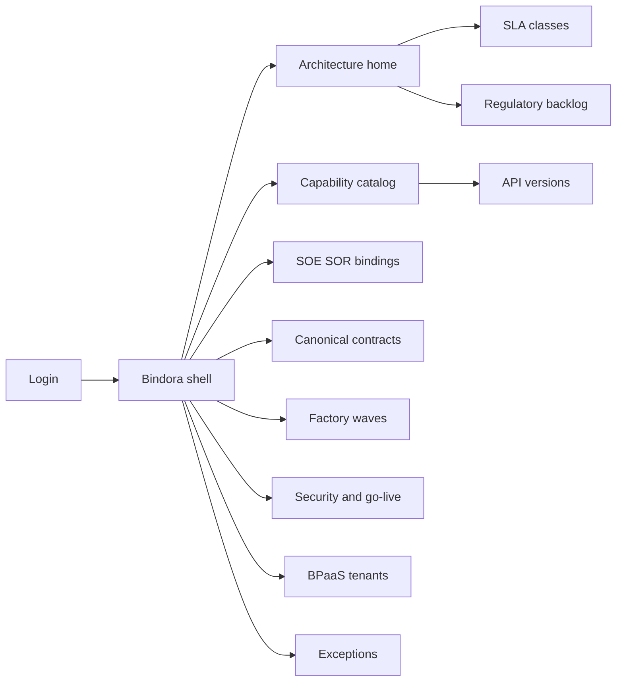
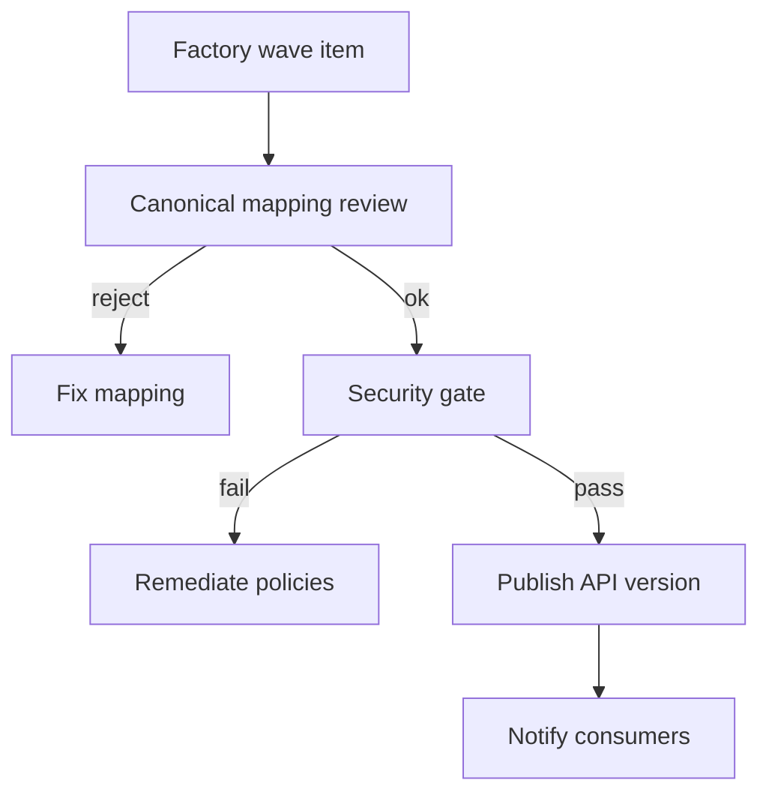

# Bindora — Web app

**Product:** [PRODUCT.md](./PRODUCT.md)
**Primary surface:** Insurance digital-ready control plane (API catalog + SOE↔SOR governance + factory waves)
**Secondary surfaces:** Channel go-live readiness gate; BPaaS tenant partition admin
**Design thesis:** Bindora is a digital backbone switchboard for carriers and insurance BPaaS — the UI metaphor is SOE (engagement) plugs into SOR (record) only through catalogued, versioned business APIs, untangling the legacy hairball without pretending the ESB is the product. Visual language is policy-document cream ink on deep binder navy with seal-green for certified publish and debt-amber for time-boxed point-to-point exceptions. The brand wordmark sits on every publish and go-live screen so architects know governed contracts are the product, not another Mule flow gallery.

## UX research synthesis

### Category peers (best-in-class)

- **MuleSoft Anypoint Exchange / API Manager:** Capability catalog, versioned contracts, gateway policies. Steal: consumer list + SLA per API; reject Exchange-as-marketplace aesthetics that underplay SOR authoritative-writer rules.
- **Apigee / Kong enterprise:** Publish-time security gates, credential vault bindings, traffic classes. Steal: security check before production publish; reject generic “API product” chrome without insurance domain taxonomy.
- **Guidewire / core admin consoles (integration facets):** Policy, billing, claims as systems of record. Steal: entity-level authoritative writer clarity; reject core screens as the digital experience layer.
- **Backstage / Spotify-style API portals:** Owned services with scorecards. Steal: factory-wave delivery and ownership; reject pure software-catalog neutrality where insurance needs IFRS/regulatory backlog linkage.

### Patterns to adopt / reject

- **Adopt:** SOE/SOR binding per entity; real-time default vs justified batch; canonical mapping review; factory waves (governance → frameworks → business services); channel go-live blocked without catalogued APIs; point-to-point debt with retirement dates; tenant partitions for BPaaS.
- **Reject:** Point-to-point as normal; overnight batch as silent default; purple “API economy” marketing; shared-DB partner access; launching portals when policy/billing APIs missing.

### Trust, density, and workflow constraints from PRODUCT.md

PII/PHI/financial fields need field-level permissions on canonical models (BR-5). Secrets stay in vault — Bindora stores bindings only. SOR owners fear SOE bypass (BR-1). Multi-client BPaaS must never leak across tenants (BR-9). Density is architect-grade on catalog; channel leads get go-live checklist; partners see scoped contracts only.

## Information architecture

### Nav model

### Roles → default home

| Role | Default home | Why |
|------|--------------|-----|
| VP architecture / digital transformation | Architecture home — % journeys on governed APIs | Hairball reduction (BR-12) |
| API product owner (policy/billing/claims) | Capability catalog | Versions and consumers (BR-2) |
| Core SOR owner | SOE/SOR bindings | Authoritative writer (BR-1) |
| Digital channel / agent experience | Go-live gates | Block broken self-service (BR-12) |
| Security / data steward | Security gates + glossary links | Publish controls (BR-6, BR-8) |
| Factory PMO | Factory waves | Phased predictability (BR-3) |
| BPaaS admin | Tenants | Multi-client partitions (BR-9) |

### Cross-links to OpenAPI resources

| Nav area | OpenAPI tags / resources |
|----------|---------------------------|
| Capabilities, API contracts/versions | Catalog |
| SOE/SOR bindings | Bindings |
| Canonical entities, field mappings | Contracts |
| Factory waves | Factory |
| Security check, go-live | Gates |
| Partner/tenant partitions | Tenants |
| Point-to-point exceptions, SLA classes | Governance |

## Screen inventory

### Architecture home

- **Purpose:** Answer “are digital journeys on the backbone, or still growing the hairball?” in one composition.
- **Entry:** VP architecture post-login.
- **Layout regions:** Brand + program switcher; strip (% journeys on governed APIs, real-time vs batch, open P2P debt age, security-gate pass rate); factory wave progress; alerts (go-live blocks, SLA breaches, regulatory backlog).
- **Primary actions:** Open blocked channel; advance factory wave; retire exception.
- **Empty / loading / error:** Empty = start Installation & Governance wave; loading = skeleton meters; error = retry with request id.
- **BR / story ties:** BR-3, BR-4, BR-12.

### Capability and API catalog

- **Purpose:** Domain services (policy, billing, claims, agent, correspondence, UW) with versioned contracts and consumers.
- **Entry:** Catalog nav; API owner default.
- **Layout regions:** Domain tree; contract list; version timeline; consumer registry; real-time/batch badge.
- **Primary actions:** Create contract; publish version; deprecate; notify consumers.
- **Empty / loading / error:** Empty = seed Digital Life & Annuity / P&C domain templates.
- **BR / story ties:** BR-2, BR-4.

### SOE / SOR bindings

- **Purpose:** Declare engagement vs record systems and authoritative writer per entity.
- **Entry:** Bindings nav; SOR owner home.
- **Layout regions:** Entity table (policy, billing, claim, party, agent); SOE list; SOR writer; bypass attempts log.
- **Primary actions:** Set writer; approve SOE participant; block illicit write path.
- **Empty / loading / error:** Missing writer = cannot publish mutating API.
- **BR / story ties:** BR-1; core owner stories.

### Canonical contracts and mappings

- **Purpose:** Interchange models and field mappings; prevent partner-specific forks.
- **Entry:** Contracts nav.
- **Layout regions:** Canonical entity editor; mapping review queue; compatibility matrix; field-level permission flags.
- **Primary actions:** Submit mapping; approve; reject fork.
- **Empty / loading / error:** Unreviewed mapping = publish blocked.
- **BR / story ties:** BR-5.

### Factory delivery waves

- **Purpose:** Phased Installation & Governance → Frameworks → Business service factory.
- **Entry:** PMO → Factory.
- **Layout regions:** Wave board; reusable pattern library; wave advance criteria; dependency on maturity.
- **Primary actions:** Advance wave; attach pattern; report predictability.
- **Empty / loading / error:** Skip-ahead without criteria = blocked.
- **BR / story ties:** BR-3; transformation stories.

### Security and gateway policy gate

- **Purpose:** Gateway policies, vault bindings, audit logging before production publish.
- **Entry:** Gates → Security; publish workflow.
- **Layout regions:** Checklist; vault reference status; policy attach; pass/fail.
- **Primary actions:** Run security check; remediate; approve publish.
- **Empty / loading / error:** Fail = coral publish lock; never store raw secrets in UI.
- **BR / story ties:** BR-6; security stories.

### SLA and availability classes

- **Purpose:** Declare and monitor 24/7 digital classes per API.
- **Entry:** Architecture → SLA; contract detail.
- **Layout regions:** Class catalog; per-API assignment; breach timeline; real-time preference enforcement.
- **Primary actions:** Assign class; acknowledge breach; justify batch exception.
- **Empty / loading / error:** No class = cannot certify for channel go-live.
- **BR / story ties:** BR-4, BR-7.

### Data governance linkage

- **Purpose:** Glossary, quality rules, lineage to warehouse for mutating/exposing APIs.
- **Entry:** Steward tools; contract sidebar.
- **Layout regions:** Linked terms; DQ rules; lineage to analytics; IFRS backlog tags.
- **Primary actions:** Link term; open regulatory item; export evidence.
- **Empty / loading / error:** Mutating API without glossary link = amber.
- **BR / story ties:** BR-8, BR-11.

### Channel go-live readiness

- **Purpose:** Block channel features until required policy/billing/claims APIs are catalogued at SLA.
- **Entry:** Channel lead default; Gates → Go-live.
- **Layout regions:** Journey checklist (quote-bind-pay-service); required APIs; SLA status; sign-off.
- **Primary actions:** Request APIs; approve go-live; block with gaps listed.
- **Empty / loading / error:** Missing API = coral block naming owners.
- **BR / story ties:** BR-12; agent experience stories.

### Point-to-point exception registry

- **Purpose:** Time-boxed emergency integrations registered as debt with retirement dates.
- **Entry:** Governance → Exceptions.
- **Layout regions:** Debt queue; countdown; retirement plan; API replacement target.
- **Primary actions:** Grant exception; extend with approval; retire to catalogued API.
- **Empty / loading / error:** Overdue debt = coral escalate.
- **BR / story ties:** BR-10.

### BPaaS tenant partitions

- **Purpose:** Multi-client composition without SOR internals or cross-client leakage.
- **Entry:** Tenants admin.
- **Layout regions:** Tenant list; partition scope; allowed contracts; isolation test.
- **Primary actions:** Provision tenant; grant contract; run isolation check.
- **Empty / loading / error:** Isolation fail = block publish to tenant.
- **BR / story ties:** BR-9; admin stories.

### Regulatory / IFRS contract backlog

- **Purpose:** Express regulatory data needs as owned API/data contract items.
- **Entry:** Architecture → Regulatory.
- **Layout regions:** Backlog (IFRS 17/9, DOL-type); owners; linked contracts; due dates.
- **Primary actions:** Create item; link contract; mark delivered.
- **Empty / loading / error:** Empty = healthy with last review date.
- **BR / story ties:** BR-11.

## Key flows

1. **Factory publish** — wave ready → canonical mapping approve → security gate → publish version → consumers notified; failure: gate fail locks publish.

2. **Channel go-live** — journey defined → required APIs check → SLA class ok → sign-off; failure: missing API blocks launch.

3. **SOE write attempt** — channel calls mutating API → binding checks SOR writer → allow/deny; illicit path logged.

4. **P2P exception** — emergency grant → time box → retirement to catalogued API; failure: overdue escalates.

5. **Tenant onboarding** — provision partition → grant scoped contracts → isolation test → client go-live.

## Design system

### Tokens (CSS variables)

- `--color-ink: #E8EEF5` — text on navy
- `--color-binder-950: #0A1220` — ground
- `--color-binder-900: #121C2E` — panels
- `--color-binder-700: #2A3A52` — rules
- `--color-seal: #3FA67A` — certified publish / go-live pass
- `--color-debt: #D4A017` — P2P exception / batch justification
- `--color-coral: #D94F45` — security fail / go-live block
- `--color-steel: #8A9BB0` — secondary
- `--color-brand: #A8C0D8` — Bindora wordmark (binder steel)
- `--font-display: "Source Sans 3", sans-serif`
- `--font-mono: "Source Code Pro", monospace` — API versions, tenant ids
- `--space-1`…`--space-8`: 4px scale
- `--radius-sm: 4px`; `--radius-md: 8px`
- `--motion-seal: 180ms ease-out` — publish certify
- `--motion-debt: 260ms ease-in-out` — exception pulse
- Atmosphere: faint blueprint connector lines (SOE→API→SOR) on binder-900; no purple API-economy glow; avoid cream-serif insurance brochure kit.

### Typography & brand

- Display for domain names and % governed journeys; mono for versions, gateway policy ids.
- Brand on publish and go-live; login: “Engage through APIs. Record stays sovereign.”; one CTA.

### Do / don’t

- **Do:** Show authoritative writer; default real-time; seal publish only after security; time-box P2P; block channel without APIs.
- **Don’t:** ESB flow designer as home; purple glow; partner DB access; silent batch; editable published contract history without versioning.

### Accessibility & domain trust cues

- AA+ contrast; go-live/security states use icon + text.
- Live regions for SLA breach and debt expiry.
- Focus: binding → contract → security → publish → go-live.
- Audit exports for who published and who mutated via which API version.

## Component patterns

- **SoeSorBindingRow** — entity with authoritative writer.
- **ApiVersionTimeline** — contracts with consumers.
- **CanonicalMappingReview** — approve/reject forks.
- **FactoryWaveBoard** — governance → frameworks → services.
- **SecurityPublishGate** — vault + policy checklist.
- **GoLiveJourneyChecklist** — required APIs + SLA.
- **PointToPointDebtChip** — retirement countdown.
- **TenantPartitionCard** — isolation scope for BPaaS.

## Out of scope for v1 web

- Full ESB/flow visual designer; replacing Guidewire/policy admin UIs; consumer mobile apps; RPA bot studio; multi-carrier public API marketplace; storing raw gateway secrets in-browser.
